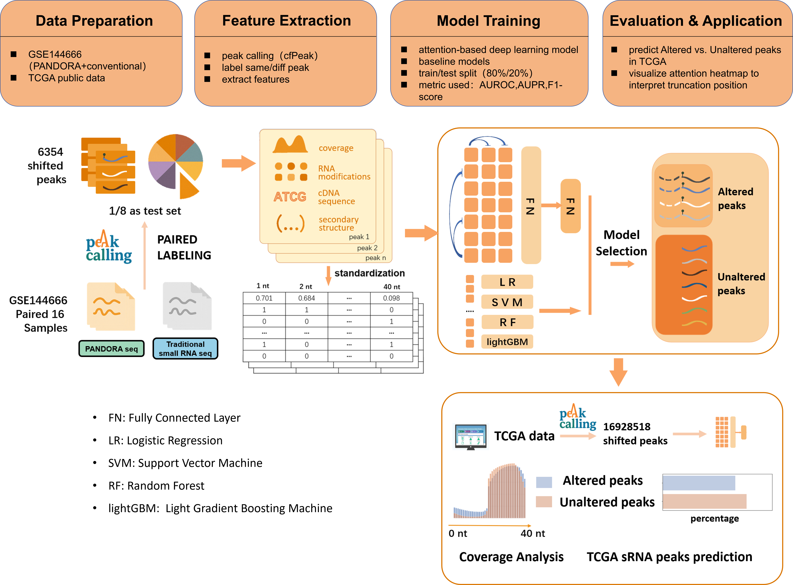

#  Truncated_Peaks_Classifier_demo

## Introduction

Version: 0.1 2024/12/10

Author: Zhang Yusa

Truncated_Peaks_Classifier_demo: The demo version of a serious machine learning  models to identify if a peak has been interrupted due to modifications  during a normal sRNA NGS  data analysis.

## Dataset


## Model Structure



## To do list

- This project uses some code from the open-source repositories [YangLab](https://github.com/YangLab)/[RNAlight](https://github.com/YangLab/RNAlight), licensed under the MIT open-source license. Complete citations and the LICENSE file are yet to be added.
- Uploaded the modified scripts for ablation significance analysis and plotting in `truncated_peak_classifier_demo/ablation/`.
- Updated the README file with Introduction, Dataset, and other sections.
- Implemented five-fold cross-validation in DL.
- Performed ablation of features and model structure in DL.

## Requirments for repeat this work

- python

  ```
  python: 3.10.12
  numpy: 1.26.4
  pandas: 2.2.1
  lightgbm: 4.5.0
  sklearn: 1.4.1.post1
  joblib: 1.3.2
  matplotlib: 3.8.3
  IPython: 8.14.0
  torch: 2.2.2+cpu
  seaborn: 0.13.2
  ```

## Folder directories
Introduction of folders in `truncated_peak_classifier_demo`

- **ablations**: Contains Python scripts for performing ablation analysis on features using LR and SVM, as well as the output CSV files.
- **prepared_samples**: Output files from the preprocessing scripts in the `sample_preprocessing` folder, used as input for deep learning or machine learning models.
- **resources**: Contains intermediate sample files, including peak coverage, sequences, and modification coverage, which serve as input for the preprocessing scripts in `sample_preprocessing`. These are the starting files for the project.
- **sample_preprocessing**: Contains scripts for preprocessing the intermediate sample files in `resources`, as well as scripts for visualizing feature distributions.
- **saved_models**: Contains output and model save files for machine learning (ML) and two types of model save files for deep learning (DL).
- **training_notebooks**: Contains Jupyter notebooks for building and training machine learning (ML) and deep learning (DL) models.

